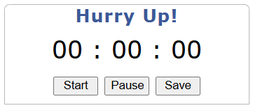
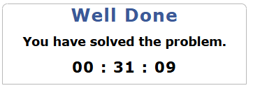
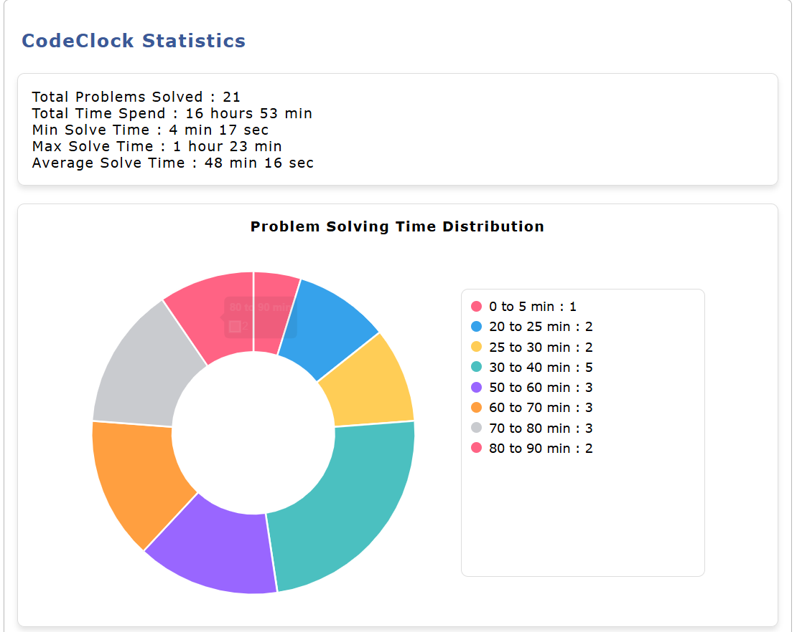
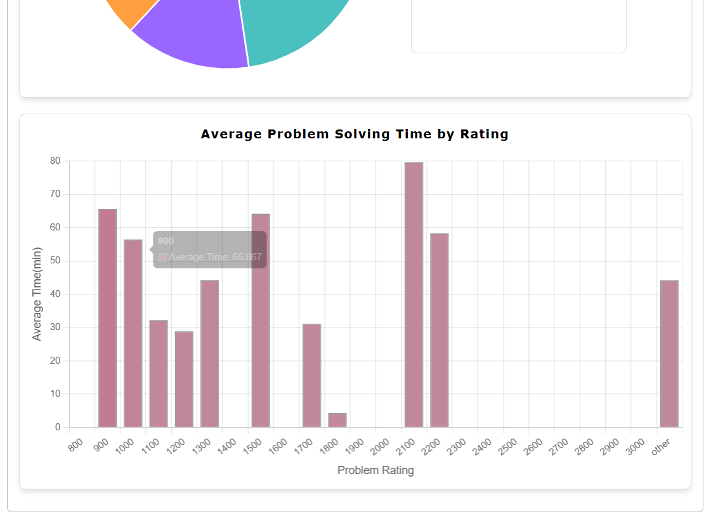
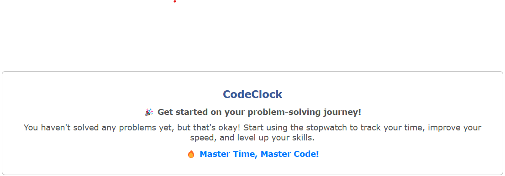
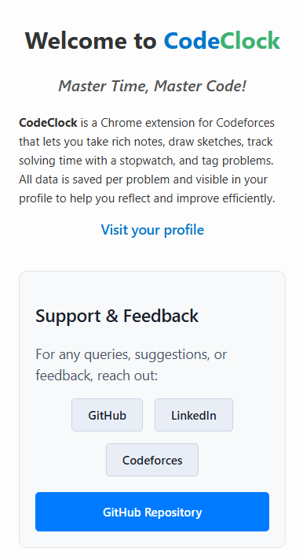

# ⏰ CodeClock : Codeforces Stopwatch & Statistics Chrome Extension  

**Track your problem-solving time and improve your performance on Codeforces!**  

## 📌 Features  

✅ **Stopwatch for Codeforces Problems** – Track time on particular problem while solving or after solved directly from the problem page sidebar.  
✅ **Time Tracking** – Automatically saves time taken per problem in IndexedDB for tracking progress on your problem solving speed.  
✅ **Statistics Dashboard** – View insights on problem-solving performance in the Codeforces profile section.  

## 📸 Screenshots  

### 🏆 Problem Solving Experience  
<p align="center"></p>  
<p align="center">Sidebar on the problem page</p>  

<p align="center"></p>  
<p align="center">Inactive sidebar before solving</p>  

<p align="center"></p>  
<p align="center">Active sidebar while solving</p>  

<p align="center"></p>  
<p align="center">Sidebar after solving, showing recorded time</p>  

### 📊 Performance Tracking in Codeforces Profile  
<p align="center"></p>  
<p align="center">Overview of solving statistics</p>  

<p align="center"></p>  
<p align="center">Detailed statistics with problem-wise insights</p>  

### ⚙️ Additional Features  
<p align="center"></p>  
<p align="center">CodeClock integrated into Codeforces profile</p>  

<p align="center"></p>  
<p align="center">Popup menu for quick actions</p>

 

## 🛠 Installation (Unpacked) 

Since this extension is not yet published in the Chrome Web Store, follow these steps to install it manually:  

Before running the extension, ensure you have the following installed:  
- **Node.js** (>= 16) & **npm** (or **pnpm/yarn**)  
- **Vite** (installed via package manager) 

1. **Clone the Repository**:  
   ```sh
   git clone https://github.com/Sowrav14/CodeClock.git
   cd CodeClock
   ```
2. **Build the Extension**:  
   ```sh
   npm install
   npm run build
   ```
3. **Load the Extension in Chrome**:  
   - Open `chrome://extensions/` in Chrome.  
   - Enable **Developer Mode** (top-right corner).  
   - Click **Load Unpacked** and select the `dist` folder inside the cloned repo.  

Now, the extension is ready to use! 🎉  

## 🎯 How to Use  

1. **Open a Codeforces Problem Page** – The stopwatch will appear in the sidebar.  
2. **Start the Timer** – Click to begin tracking.  
3. **Solve the Problem** – Work on your solution while the timer runs.  
4. **Stop & Save** – The extension saves the time taken automatically.  
5. **View Statistics** – Check your performance in the **Profile Section** of Codeforces.  

## 👨‍💻 Developer Guide  

Want to contribute or understand the code? Here's what you need:  

- **Tech Stack**:  
  - Vite + React + Typescript
  - IndexedDB for local storage  
  - Chrome Extension APIs  

- **Project Structure**:  
  ```
  /src
    ├── components   # UI Components
    ├── popup        # Popup menu script
    ├── background   # Background scripts
    ├── content      # Content scripts
    ├── utils        # Utility functions
    ├── css          # Styling
  ```

- **Useful Resources**:  
  - [Building a Chrome Extension](https://developer.chrome.com/docs/extensions/)  
  - [Chrome Extensions with Vite & React](https://vitejs.dev/guide/)  
  - [IndexedDB Documentation](https://developer.mozilla.org/en-US/docs/Web/API/IndexedDB_API)
  - [Medium Blog-1](https://dev.to/bnn1/mise-en-place-31n5)
  - [Medium Blog-2](https://dev.to/arglee/chrome-extensions-using-vite-typescript-react-stepwise-process-2ddp)

## 🚀 Future Plans  

🔹 **Detailed Statistics** – More insights like per-topic and per-rating performance and speed analysis.  
🔹 **Real-time Database** – Compare your solving time with other users.  
🔹 **Problem-wise Standings** – View rankings based on solving speed.    
🔹 **Contest tracking** – Track of time in realtime and virtual contest and show detailed statistics. 

## 🤝 Contributing  

Contributions are welcome!  

### How to Contribute:  
1. Fork the repository.  
2. Create a new branch: `git checkout -b feature-name`.  
3. Make your changes & commit: `git commit -m "Add new feature"`.  
4. Push to your fork: `git push origin feature-name`.  
5. Create a Pull Request.  

## 💬 Feedback & Support  

Found a bug? Have a suggestion? Open an issue or reach out!  

📧 Email: sowravvnath@gmail.com  
LinkedIn: [](https://www.linkedin.com/in/sowrav-nath/) 