# ⏰ CodeClock: Chrome Extension for Codeforces

**Track your solving time, take notes & sketches, and analyze your performance – all within Codeforces!** 


## 📌 Features  

- ⏱️ **Stopwatch** – Track time directly from the problem page sidebar.
- 📝 **Rich Notes & Sketches** – Take notes and draw visual solutions per problem.
- 📊 **Performance Stats** – Analyze problem-wise time, tags, and accuracy.
- 🏷️ **Tagging System** – Tag problems to filter and reflect later for notes and quick revision.
- 💾 **Offline Storage** – Saves data locally via IndexedDB.


## 📸 Screenshots

<details> <summary>🏆 Problem Solving Interface</summary>

<p align="center">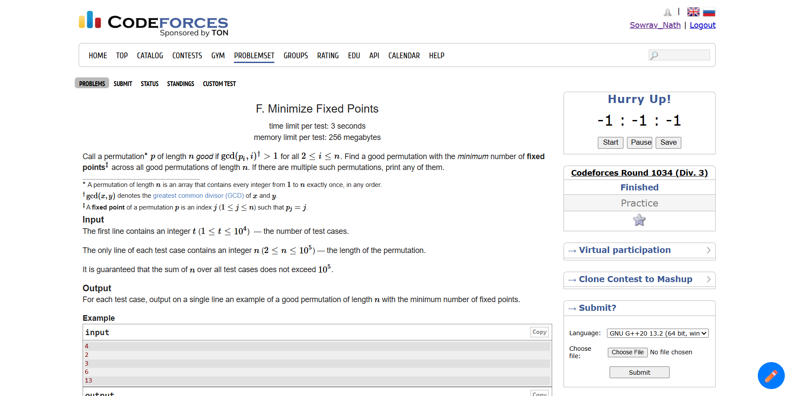</p> <p align="center">Displays stopwatch and problem-specific controls in the sidebar.</p>


<p align="center">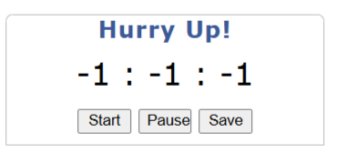</p> <p align="center">Interface when a new problem-solving session begins.</p>


<p align="center">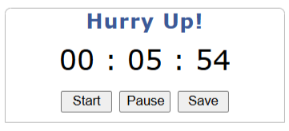</p> <p align="center">Timer runs while solving the problem.</p>


<p align="center">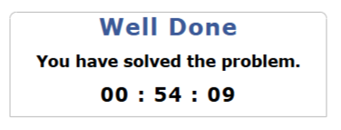</p> <p align="center">Displays the recorded solving time post-completion.</p>
</details> <details> <summary>✏️ Drawing & Note-Taking Tools</summary>


<p align="center"></p> <p align="center">Floating action button for opening drawing or note-taking tools.</p>


<p align="center">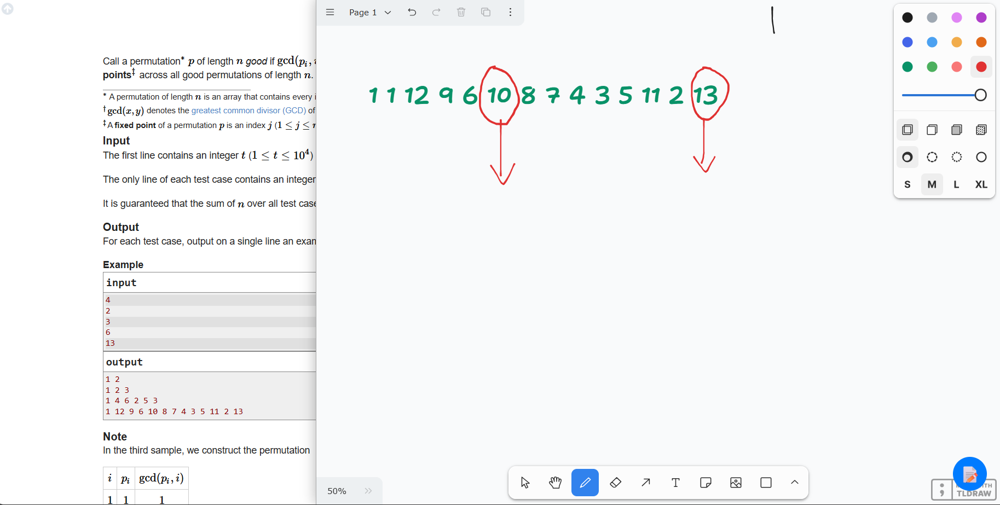</p> <p align="center">Sketching ideas or visualizing concepts during problem solving.</p>


<p align="center">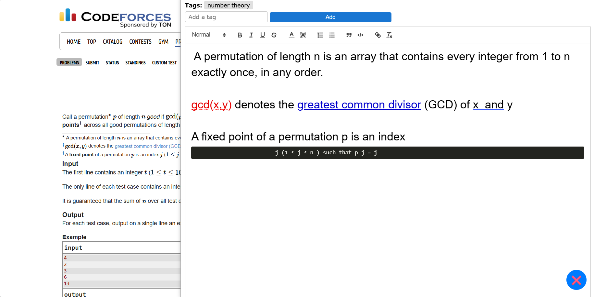</p> <p align="center">Documenting observations or strategies while solving.</p>
</details> <details> <summary>📊 Performance Tracking</summary>


<p align="center">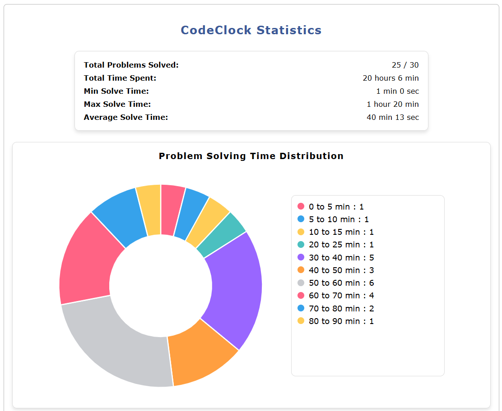</p> <p align="center">Overview of solved problems and associated metrics.</p>


<p align="center">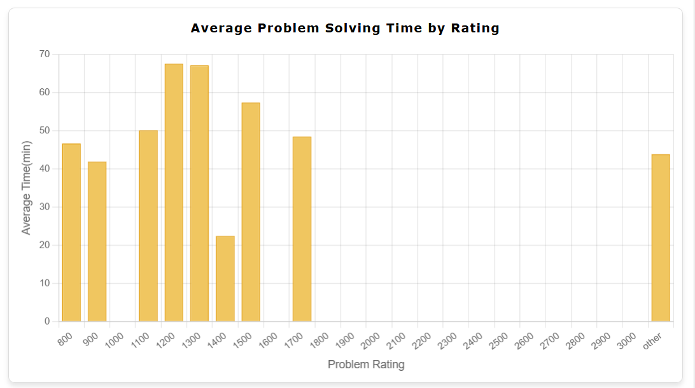</p> <p align="center">Detailed breakdown of performance trends.</p>


<p align="center">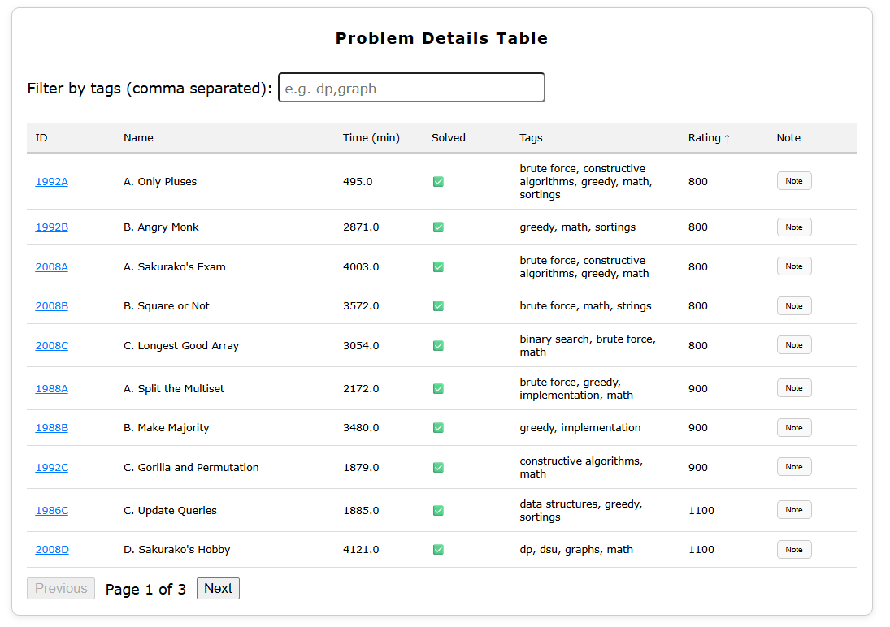</p> <p align="center">Compact table summarizing problem history for review.</p>


<p align="center">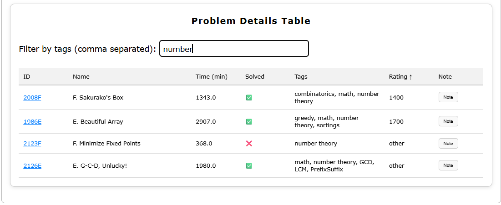</p> <p align="center">Filter problems by tags for focused revision.</p>


<p align="center">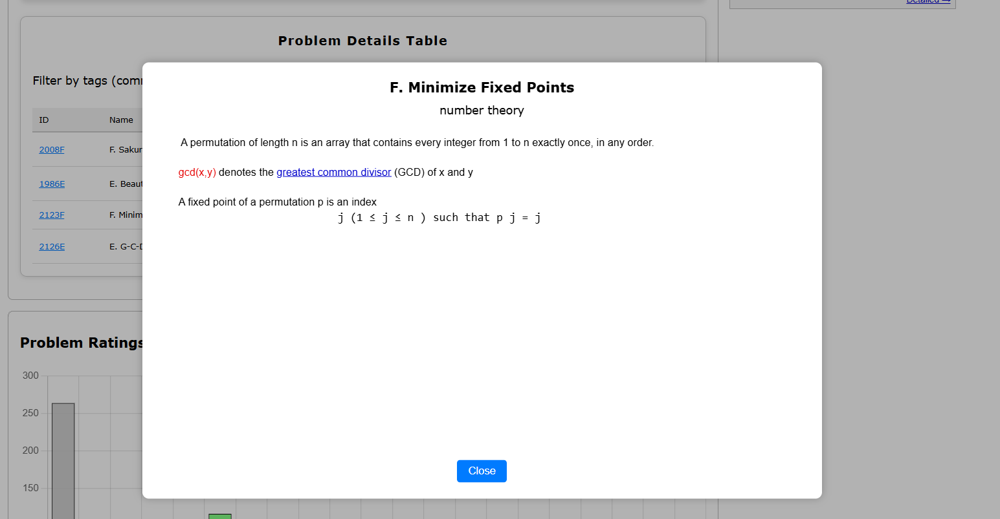</p> <p align="center">View and edit personal notes per problem.</p>
</details> <details> <summary>⚙️ Additional Features</summary>


<p align="center"></p> <p align="center">Displays CodeClock summary in the user’s Codeforces profile.</p>


<p align="center"></p> <p align="center">Provides quick access to common extension features.</p>
</details>

 


## 🛠 Installation (Unpacked) 

Since this extension is not yet published in the Chrome Web Store, follow these steps to install it manually:  

Before running the extension, ensure you have the following installed:  
- **Node.js** (>= 16) & **npm** (or **pnpm/yarn**)  
- **Vite** (installed via package manager) 

1. **Clone the Repository**:  
   ```sh
   git clone https://github.com/Sowrav14/CodeClock.git
   cd CodeClock
   ```
2. **Build the Extension**:  
   ```sh
   npm install
   npm run build
   ```
3. **Load the Extension in Chrome**:  
   - Open `chrome://extensions/` in Chrome.  
   - Enable **Developer Mode** (top-right corner).  
   - Click **Load Unpacked** and select the `dist` folder inside the cloned repo.  

Now, the extension is ready to use! 🎉  


## 🧑‍💻 Usage Guide  

1. **Open a Codeforces Problem Page** – The stopwatch will appear in the sidebar.  
2. **Start the Timer** – Click to begin tracking.  
3. **Solve the Problem** – Work on your solution while the timer runs.  
4. **Draw & Note** - Navigate the bottom right corner for Drawing and Note taking dialog, use it for sketching the problem and taking note for the problem. You can also tag the problem for your convenient of tracking it later.
5. **Stop & Save** – The extension saves the time taken automatically.  
6. **View Statistics** – Check your performance in the **Profile Section** of Codeforces.  
7. **Problems Tracking** - In profile section you also find the table of problems solved using CodeClock. You can see your saved notes for quick revision by filtering by tags.


## 👨‍💻 Developer Guide  

Want to contribute or understand the code? Here's what you need:  

- **Tech Stack**:  
  - Vite + React + Typescript
  - IndexedDB for local storage  
  - Chrome Extension APIs  

- **Project Structure**:  
  ```
  /src
    ├── components   # UI Components
    ├── popup        # Popup menu script
    ├── background   # Background scripts
    ├── content      # Content scripts
    ├── utils        # Utility functions
    ├── css          # Styling
  ```

- **Useful Resources**:  
  - [Building a Chrome Extension](https://developer.chrome.com/docs/extensions/)  
  - [Chrome Extensions with Vite & React](https://vitejs.dev/guide/)  
  - [IndexedDB Documentation](https://developer.mozilla.org/en-US/docs/Web/API/IndexedDB_API)
  - [Medium Blog-1](https://dev.to/bnn1/mise-en-place-31n5)
  - [Medium Blog-2](https://dev.to/arglee/chrome-extensions-using-vite-typescript-react-stepwise-process-2ddp)


## 📅 Roadmap 

🔹 **Detailed Statistics** – More insights like per-topic and per-rating performance and speed analysis.  
🔹 **Real-time Database** – Compare your solving time with other users.  
🔹 **Problem-wise Standings** – View rankings based on solving speed.    
🔹 **Contest tracking** – Track of time in realtime and virtual contest and show detailed statistics. 


## 🤝 Contributing  

Contributions are welcome!  

### How to Contribute:  
1. Fork the repository.  
2. Create a new branch: `git checkout -b feature-name`.  
3. Make your changes & commit: `git commit -m "Add new feature"`.  
4. Push to your fork: `git push origin feature-name`.  
5. Create a Pull Request.  


## 💬 Feedback & Support  

Found a bug? Have a suggestion? Open an issue or reach out!  

📧 Email: sowravvnath@gmail.com  
LinkedIn: [](https://www.linkedin.com/in/sowrav-nath/) 